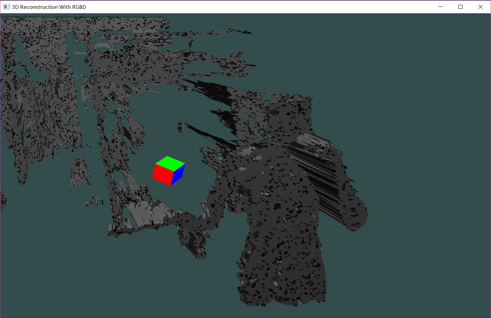
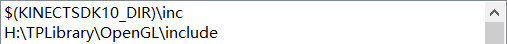
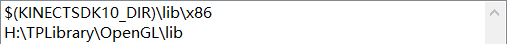

# 3D-Reconstruction-With-RGBD [简体中文]: https://github.com/Dove2/3D-Reconstruction-With-RGBD/blob/master/README-CN.md

## Introduce
This is a demo built in the third term of BUCT. It is a task assigned by *HuWei* which requires us make a work with Kinect.So we do a 3D-Reconstruction with it. This demo is not completely finished. Therefore it leaves many unconstructed or under constructing function. In this demo, we implement the function of four display mode for model we construct with point could. And implement a simple AR function.

## Features

- [x] connect Kinect with OpenGL.
- [x] point cloud construction.
- [x] plane construction by triangulation from point cloud.
- [x] distant display mode.
- [x] normal display mode.
- [x] light display mode.
- [x] color display mode.
- [ ] AR(far from perfect).
- [ ] Complete Documentation

## Requirements

* Windows 10 OS
* Microsoft Visual Studio 2017(version may not matter)
* Kinect SDK v1.8
* OpenGL v3.3
	* glfw3
	* glad

## how to use

#### setting attributes of project

1. include directory:
	
	
	
2. library directory:

	
3. additional dependencies:
	
    	kernel32.lib
		user32.lib
		winspool.lib
		comdlg32.lib
		advapi32.lib
		shell32.lib
		ole32.lib
		oleaut32.lib
		uuid.lib
		odbc32.lib
		odbccp32.lib
		Kinect10.lib
		glfw3.lib
		opengl32.lib

## Next Step
if I have time, I will continue finish this demo until it can at least work like a simple product. Due to the fact that now I am going to take part in the postgraduate entrance exams, this demo can be updated at least after half a year.

## License

3D-Reconstruction-With-RGBD is released under the MIT license. See LICENSE for details.
